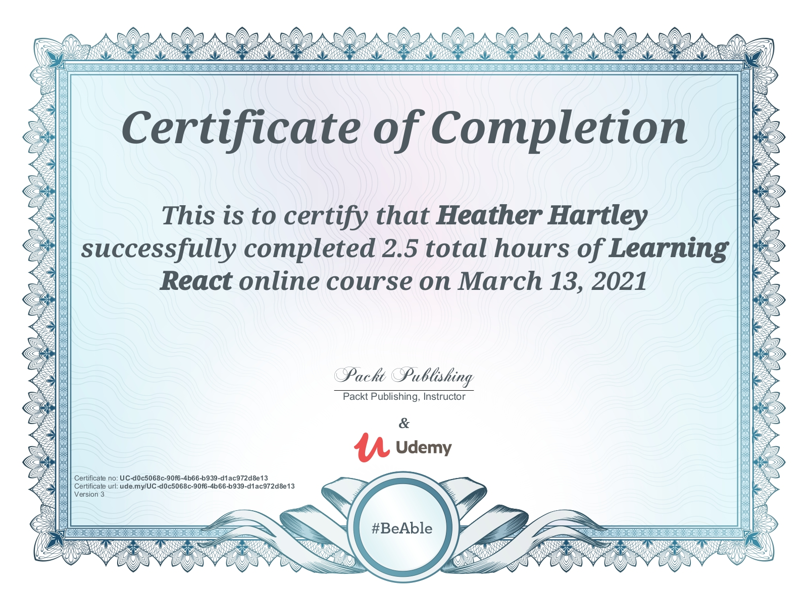

# Udemy - Learning React Course
- I completed a 2.5 hour Udemy - Learning React Course in order to review my skills as well as teach my team about React

## Course Contents
- Set up and dev tools
- Node JS
- Create-react-app
- State
- Stateful vs stateless components
- React Hooks
- React Router
- Fetching and displaying data from APIs
- Deploying to prod & continuous deployment using GitHub and Netlify

## PPT
[A PPT I created for my Lunch 'n Learn presentation](https://docs.google.com/presentation/d/1KZxs0QLMxvISEgjARX7Cj7QA_y5XeSqhYW5bw-9aJ7s/edit?usp=sharing)

## Udemy Course Link
[Udemy - Learning React Course](https://www.udemy.com/course/learning-react/)

## Udemy Certificate

